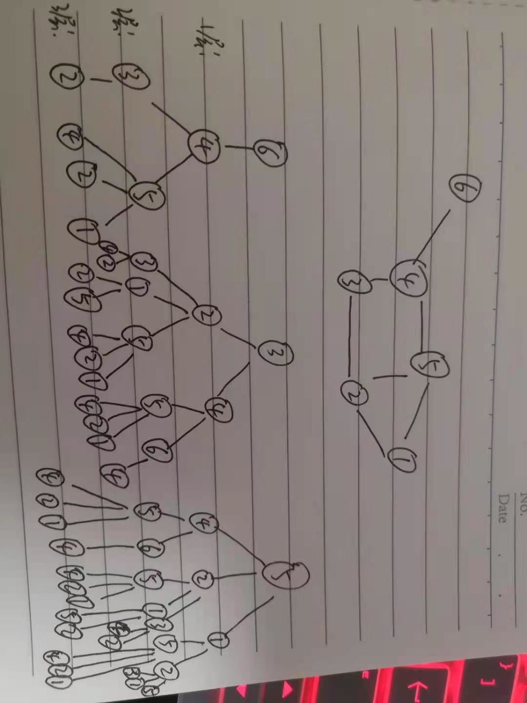

# 基于图神经网络的图表征学习方法

大致过程：

1.计算节点特征
2.对图上每个节点的特征做池化，得到这个图的表示，然后就可以输出

就是说，把所有节点的特征聚合在一起作为图的特征，然后作为这个图的表示，然后对图进行下游操作，比如分类什么之类的。

## 图表征模块

引入 GINNodeEmbedding 对图里的节点进行处理

```python
# 基于图神经网络的图表征学习方法
import torch
from torch import nn
from torch_geometric.nn import global_add_pool, global_mean_pool, global_max_pool, GlobalAttention, Set2Set
from gin_node import GINNodeEmbedding

class GINGraphRepr(nn.Module):
    def __init__(self, num_tasks=1, num_layers=5, emb_dim=300, residual=False, drop_ratio=0, JK="last", graph_pooling="sum"):
        """GIN Graph Pooling Module
        Args:
            num_tasks (int, optional): number of labels to be predicted. Defaults to 1 (控制了图表征的维度，dimension of graph representation).
            num_layers (int, optional): number of GINConv layers. Defaults to 5.
            emb_dim (int, optional): dimension of node embedding. Defaults to 300.
            residual (bool, optional): adding residual connection or not. Defaults to False.
            drop_ratio (float, optional): dropout rate. Defaults to 0.
            JK (str, optional): 可选的值为"last"和"sum"。选"last"，只取最后一层的结点的嵌入，选"sum"对各层的结点的嵌入求和。Defaults to "last".
            graph_pooling (str, optional): pooling method of node embedding. 可选的值为"sum"，"mean"，"max"，"attention"和"set2set"。 Defaults to "sum".
        Out:
            graph representation
        """
        super(GINGraphPooling, self).__init__()

        self.num_layers = num_layers
        self.drop_ratio = drop_ratio
        self.JK = JK
        self.emb_dim = emb_dim
        self.num_tasks = num_tasks

        if self.num_layers < 2:
            raise ValueError("Number of GNN layers must be greater than 1.")
        # 图节点表示
        self.gnn_node = GINNodeEmbedding(num_layers, emb_dim, JK=JK, drop_ratio=drop_ratio, residual=residual)

        # Pooling function to generate whole-graph embeddings  池化
        if graph_pooling == "sum":
            self.pool = global_add_pool
        elif graph_pooling == "mean":
            self.pool = global_mean_pool
        elif graph_pooling == "max":
            self.pool = global_max_pool
        elif graph_pooling == "attention":
            self.pool = GlobalAttention(gate_nn=nn.Sequential(
                nn.Linear(emb_dim, emb_dim), nn.BatchNorm1d(emb_dim), nn.ReLU(), nn.Linear(emb_dim, 1)))
        elif graph_pooling == "set2set":
            self.pool = Set2Set(emb_dim, processing_steps=2)
        else:
            raise ValueError("Invalid graph pooling type.")

        if graph_pooling == "set2set":
            self.graph_pred_linear = nn.Linear(2*self.emb_dim, self.num_tasks)
        else:
            self.graph_pred_linear = nn.Linear(self.emb_dim, self.num_tasks)

    def forward(self, batched_data):
        h_node = self.gnn_node(batched_data)  # 对节点进行处理

        h_graph = self.pool(h_node, batched_data.batch)  # 池化
        output = self.graph_pred_linear(h_graph)  # 线性变换

        if self.training:
            return output
        else:
            # At inference time, relu is applied to output to ensure positivity
            # 因为预测目标的取值范围就在 (0, 50] 内
            return torch.clamp(output, min=0, max=50)
```

## 节点嵌入模块

就是如何对节点进行embedding的：

- 用AtomEncoder对其做嵌入得到第0层节点表征
- 然后逐层计算节点表征

```python
# GINNodeEmbedding 实现如下
# GNN to generate node embedding
import torch
from mol_encoder import AtomEncoder
from gin_conv import GINConv
import torch.nn.functional as F


class GINNodeEmbedding(torch.nn.Module):
    """
    Output:
        node representations
    """

    def __init__(self, num_layers, emb_dim, drop_ratio=0.5, JK="last", residual=False):
        """GIN Node Embedding Module"""

        super(GINNodeEmbedding, self).__init__()
        self.num_layers = num_layers
        self.drop_ratio = drop_ratio
        self.JK = JK
        # add residual connection or not
        self.residual = residual

        if self.num_layers < 2:
            raise ValueError("Number of GNN layers must be greater than 1.")

        self.atom_encoder = AtomEncoder(emb_dim)

        # List of GNNs
        self.convs = torch.nn.ModuleList()
        self.batch_norms = torch.nn.ModuleList()

        for layer in range(num_layers):
            self.convs.append(GINConv(emb_dim))
            self.batch_norms.append(torch.nn.BatchNorm1d(emb_dim))

    def forward(self, batched_data):
        x, edge_index, edge_attr = batched_data.x, batched_data.edge_index, batched_data.edge_attr

        # computing input node embedding
        h_list = [self.atom_encoder(x)]  # 先将类别型原子属性转化为原子表征
        for layer in range(self.num_layers):
            h = self.convs[layer](h_list[layer], edge_index, edge_attr)
            h = self.batch_norms[layer](h)
            if layer == self.num_layers - 1:
                # remove relu for the last layer
                h = F.dropout(h, self.drop_ratio, training=self.training)
            else:
                h = F.dropout(F.relu(h), self.drop_ratio, training=self.training)

            if self.residual:
                h += h_list[layer]

            h_list.append(h)

        # Different implementations of Jk-concat
        if self.JK == "last":
            node_representation = h_list[-1]
        elif self.JK == "sum":
            node_representation = 0
            for layer in range(self.num_layers + 1):
                node_representation += h_list[layer]

        return node_representation
```

## GINConv 图同构卷积层

在构建 embedding的过程中，如果对节点进行卷积的，还是参考之前的pyg里面的消息传递机制

- 消息传递
- 消息聚合
- 消息更新

## 图同构性测试

两个图是同构的，意思是两个图拥有一样的拓扑结构，能够通过重新标记将一个图转为另外一个图

WL test：就是用于测试两个图是否同构

重复执行：

1.对每一个节点，计算其中中心节点和邻居节点（聚合自身与邻接节点的标签得到一串字符串）

2.标签散列，即标签压缩，将较长的字符串映射到一个简短的标签

3.给节点重新打上标签

然后重复进行标记

注意：**当出现两个图相同节点标签的出现次数不一致时，即可判断两个图不相似**

## 作业

### 代码运行

代码由于实验室没有打开外网，还是无法进行运行测试，只有等好了在测试吧

### 节点 WL子树 结果


