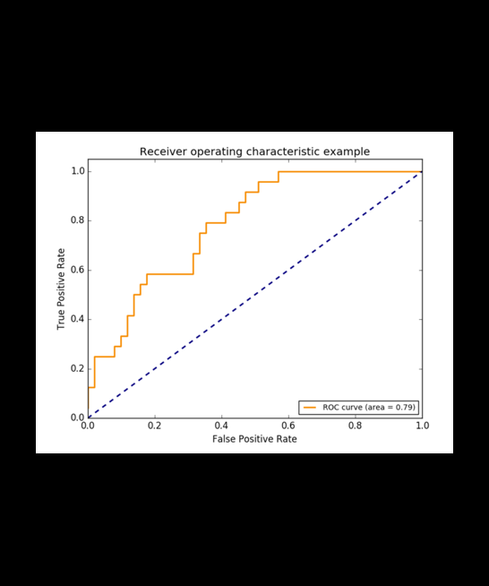

# 第一、二章

利用这次组队学习的机会，再一次复习一下机器学习基础知识，帮助自己快速复习，也正好准备秋招

## 经验误差与过拟合

### 误差

学习器实际预测输出和真实输出之间的差异

### 经验误差

学习器从训练集上的误差（学习器学习训练集就会产生的误差）

### 泛化误差

学习器在验证集（从未接触过的样本）上的误差（泛化误差，就是学习器泛化性的时候产生的误差）

### 过拟合

**在训练集上效果好，验证集上效果差（泛化性差）**；过多的学习了训练集上的特征信息，从而导致泛化性不强

- 解决：
  - 增加样本数量
  - 减少模型复杂度
  - 添加正则化（让模型不要过多学习训练集上某些样本的细节特征）
  - dropout

### 欠拟合

**在训练集上效果差，验证集上效果也差**；训练得不充分，学习器没有充分学习到训练集中的特征信息，从而训练效果差，验证集上效果也很差

- 解决：
  - 增加样本数量
  - 增加模型复杂度（用更复杂的模型学习）
  - 增加特征

## 评估法

### 留出法

留出部分样本，其他样本全部用于训练（一半82划分，91划分）

### 交叉验证

把数据分为N分，然后N-1份作为训练集，剩下一份作为验证集；如此循环N遍，每一份都作为验证集过，最后集成起来。

### 自助法

对数据进行采样来获取训练集

## 性能度量

### 性能度量

对模型泛化性能的评估，或者说一种评估标准，用来衡量模型好不好

### 精确率，召回率，F1

混淆矩阵中有着Positive、Negative、True、False的概念

称预测类别为1的为Positive（阳性），预测类别为0的为Negative（阴性）。

预测正确的为True（真），预测错误的为False（伪）。

|        |        | 预测  |       |
|  ----  |  ----  | ----  | ----  |
|        |        | 阳    | 阴    |
|  ----  |  ----  | ----  | ----  |
| 真实   | 真     | TP(a) | FN(b) |
|        | 假     | FP(c) | TN(d) |

精确率：$Precision = \frac{a}{a+c}$ **预测为阳中，有多少是为真的**（猜的精确率如何）

召回率：$Recall = \frac{a}{a+b}$ **样本中的正例有多少被预测正确了**（召回了多少）

准确率：$Accuracy = \frac{a+d}{a+b+c+d}$ **所有预测样本中，正确个数（正样本预测为正，负样本预测为负）**

F1为精确率和召回率的调和平均值：

$$F1 = \frac{2*Precision*Recall}{Precision+Recall}$$

### ROC

ROC曲线的全称是theReceiver Operating Characteristic曲线，中文名为“受试者工作特征曲线”。AUC全称是Area under the Curve，曲线下面积，这里的“曲线”一般就是指ROC曲线。所以这道面试题第一问的重点就绘制出ROC曲线，基于ROC曲线计算面积的方法是显然的。

但是ROC曲线怎么画呢？

ROC曲线的横坐标为falsepositive rate **（FPR），中文一般称为假阳性率**，纵坐标为truepositive rate **（TPR），中文一般称为真阳性率**。FPR和TPR的计算方法如下：

TPR(真阳率)就是召回率，有多少正例被检测为阳：TPRate的意义是**所有真实类别为1的样本中，预测类别为1的比例**。

$TPR = \frac{a}{a+b}$

FPR(假阳率)，有多少负例被检测为阳：（负例被检测为阳，说明是假阳）: FPRate的意义是**所有真实类别为0的样本中，预测类别为1的比例**。

$FPR = \frac{c}{c+d}$

### AUC

True Positive Rate（真阳率）、False Positive（伪阳率）

TPR(真阳率)就是召回率，有多少正例被检测为阳：TPRate的意义是**所有真实类别为1的样本中，预测类别为1的比例**。

$TPR = \frac{a}{a+b}$

FPR(假阳率)，有多少负例被检测为阳：（负例被检测为阳，说明是假阳）: FPRate的意义是**所有真实类别为0的样本中，预测类别为1的比例**。

$FPR = \frac{c}{c+d}$

按照定义，AUC即**ROC曲线下的面积**，而ROC曲线的横轴是FPRate，纵轴是TPRate，当二者相等时，即y=x，如下图

## 方差和偏差

偏差：模型训练不足，模型拟合能力不够，就是说模型太简单了，发生欠拟合

方差；模型太复杂，模型拟合过度，发生过拟合
