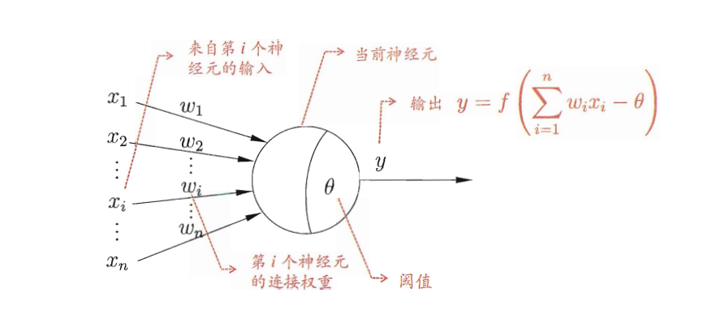
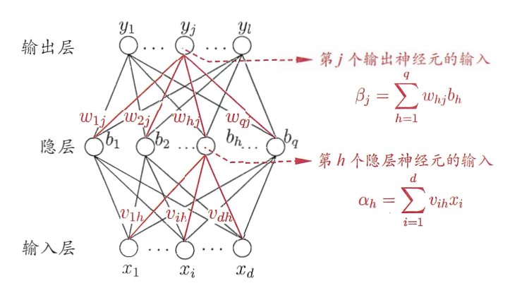

# 第五章-神经网络

## 神经元

显然，分两步：

- step1， 线性变换：
  $$Z = \sum_{i=1}^m w_i x_i - \theta$$
- step2，激活函数：
  $$y = f(z)$$

激活函数可以使用 sigmoid，relu，tanh，gelu等等

## 反向传播算法（BP算法）

核心是 **链式法则**

假如输出为 $\hat y$：

定义损失函数为：

$$E_k = \frac{1}{2} \sum^l_{j=1} (\hat{y}^k_j - y^k_j)^2$$

那么，我们根据loss对 某个参数($w_{hj}$)进行梯度更新，需要先计算其梯度，根据反向传播原理（链式法则），有：

$$\frac{\partial E_k}{\partial w_{hj}} = \frac{\partial E_k}{\partial \hat{y}^k_j} \cdot \frac{\partial \hat{y}^k_j}{\partial \beta_j} \cdot \frac{\partial \beta_j}{\partial w_{hj}}$$

其中：

$$\frac{\partial E_k}{\partial w_{hj}} = (\hat{y}^k_j - y^k_j) (\hat{y}^k_j)^{'}$$

$\beta$ 通过激活函数得到 $\hat{y}$：

$$(\hat{y}^k_j)^{'} = \frac{\partial \hat{y}^k_j}{\partial \beta_j}  \cdot \frac{\partial \beta_j}{\partial w_{hj}}= f^{'} \cdot \beta_j^{'}$$

因为：$\beta_j = \sum_{h=1}^q w_{hj} b_h$，所以：

$$\beta_j^{'} = \frac{\partial \beta_j}{\partial w_{hj}} = b_h$$

然后把各部分求解即可。
