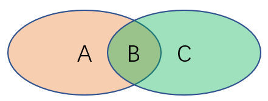
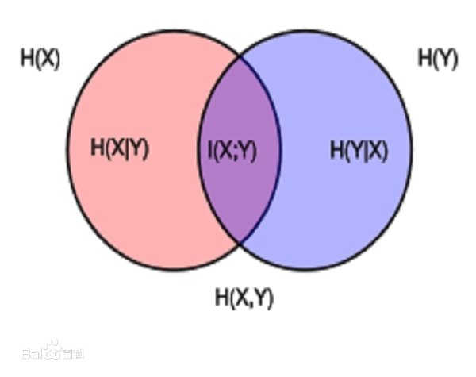

# 决策树

## 信息论基础

### 信息量

一个具体事件的信息量应该是随着其发生概率而递减的，且不能为负。就是说，越具体，越容易确定的事包含的信息越少，因为大家都知道了：

信息量公式：

$$
h(x) = - \log_2{p(x)}
$$

用来衡量某个事件的信息量

简单来说 信息的大小跟随机事件的概率有关。**越小概率的事情发生了产生的信息量越大**

### 信息熵（信息的期望）

具体的衡量标准就是 **信息度量**：信息量度量的是**一个具体事件发生了所带来的信息**，而熵则是在结果出来之前对可能产生的信息量的期望——考虑该随机变量的所有可能取值，即所有可能发生事件所带来的信息量的期望

这个其实是一个期望公式，信息熵（信息的期望）公式：

$$H(X) = - \sum^n_{i=1}{p(x_i) \log{p(x_i)}}$$

其中 $p(x_i)$ 代表随机事件X为 $x_i$ 的概率，

### 条件熵

条件熵就是：在某个条件下，基于当前条件得到的信息熵：

**在 $X = x_m$ 的条件下，得到新的 y的信息熵（y的信息期望）**：

$$
H(Y|X) = - \sum^M_{m=1} p(x_m)\sum^K_{k=1}{p(y_k|X = x_m) \log{p(y_k|X = x_m)}}
$$

### 信息增益

**信息增益 = 信息熵 - 条件熵**

信息增益（Information Gain）：即节点分裂之后带来了**多少不确定性的降低或纯度的提高**。在得到了随机变量 $X$ 的取值信息时，随机变量 $Y$ 不确定性的平均减少量为：

$$
Gain(Y, X) = H(Y) - H(Y|X)
$$

注意点：

$$ \sum^M_{m=1}p(y_k, x_m) = p(y_k) $$

$$ p(y_k|X = x_m) = \frac{p(y_k, x_m)}{x_m} $$

证明如下：

$$
Gain(Y, X) = - \sum^K_{k=1}{p(y_k) \log{p(y_k)}} - (- \sum^M_{m=1} p(x_m)\sum^K_{k=1}{p(y_k|X = x_m) \log{p(y_k|X = x_m)}}) \\
= - \sum^K_{k=1}{p(y_k) \log{p(y_k)}} + \sum^M_{m=1} p(x_m)\sum^K_{k=1}{p(y_k|X = x_m) \log{p(y_k|X = x_m)}} \\
= - \sum^K_{k=1}{[\sum^M_{m=1}p(y_k, x_m)] \log{p(y_k)}} + \sum^M_{m=1} p(x_m)\sum^K_{k=1}{p(y_k|X = x_m) \log{p(y_k|X = x_m)}} \\
= - \sum^K_{k=1}{[\sum^M_{m=1}p(y_k, x_m)] \log{p(y_k)}} + \sum^M_{m=1} \sum^K_{k=1}{p(x_m)\frac{p(y_k, x_m)}{p(x_m)} \log{\frac{p(y_k, x_m)}{p(x_m)}}} \\
= - \sum^K_{k=1}{[\sum^M_{m=1}p(y_k, x_m)] \log{p(y_k)}} + \sum^M_{m=1} \sum^K_{k=1}{p(y_k, x_m) \log{p(y_k, x_m)}} \\
= \sum^M_{m=1} \sum^K_{k=1}{p(y_k, x_m) [\log{\frac{p(y_k, x_m)}{x_m}} - \log{p(y_k)}]} \\
= \sum^M_{m=1} \sum^K_{k=1}{p(y_k, x_m) [\log{\frac{p(y_k, x_m)}{p(x_m) p(y_k)}}]} \\
= - \sum^M_{m=1} \sum^K_{k=1}{p(y_k, x_m) [\log{\frac{p(x_m) p(y_k)}{p(y_k, x_m)}}]}
$$

### 练习1

定义联合熵为：

$$
H(Y, X) = - \sum^M_{m=1}\sum^K_{k=1}{p(y_k, x_m) \log{p(y_k, x_m)}}
$$

#### 证明 G(Y, X) = H(X) - H(X|Y)

这个证明跟 上面的一摸一样

#### 证明 G(Y, X) = H(X) + H(Y) - H(Y, X)

简单来说：

$$
p(y)\log(p(y)) + p(x)\log(p(x)) \\
= p(x,y) \log(p(y)) + p(x, y) \log(p(x)) \\
= p(x, y) [\log(p(y)) + \log(p(x))] \\
= p(x, y) [\log(p(x) p(y))]
$$
$$
G(Y, X) = - p(x, y) [\log(p(x) p(y))] + p(x, y) \log (p(x, y)) \\
= p(x, y) \log (\frac{p(x, y)}{p(x)p(y)}) \\
= - p(x, y) \log (\frac{p(x)p(y)}{p(x, y)})
$$

#### 证明 G(Y, X) = H(Y, X) - H(X|Y) - H(Y|X)

道理一样

#### 识别区域

识别：$H(x), H(Y), H(X, Y), H(X|Y), H(Y|X), G(X, Y)$

## 分类树的节点分裂

每个节点进行分裂决策时，我们会抽出max_features个特征进行遍历以比较信息增益的大小。特征的类别可以分为三种情况讨论：**类别特征、数值特征和含缺失值的特征**

### ID3

ID3：Iterative Dichotomiser 3，迭代二叉树3代

具体实现说，针对某个特征 A，对于数据集 D 的条件熵 $H(D|A)$ 为:

$$H(D|A) = \sum^n_{i=1} {\frac{|D_i|}{|D|} H(D_i)} = - \sum^n_{i=1} {\frac{|D_i|}{|D|} (\sum^K_{k=1}{\frac{|D_{ik}|}{|D_i|} \log_2{\frac{|D_{ik}|}{|D_i|}}})}$$

其中 $D_i$ 表示 D 中特征 A 取第 i 个值的样本子集， $D_{ik}$ 表示 $D_i$ 中属于第 k 类的样本子集。

信息增益 = 信息熵 - 条件熵:

$$Gain(D, A) = H(D) - H(D|A)$$

信息增益越大表示使用特征 A 来划分所获得的“**纯度提升越大**”，(就是说 **在不知道特征A的情况下的信息熵和知道A条件下的信息熵之间的差别有多大**)

缺点：

    没有剪枝策略，容易过拟合；
    信息增益准则对可取值数目较多的特征有所偏好，类似“编号”的特征其信息增益接近于 1；
    只能用于处理离散分布的特征；
    没有考虑缺失值。

### 练习

- 假设当前我们需要处理一个分类问题，请问对输入特征进行归一化会对树模型的类别输出产生影响吗？请解释原因。
  - 会的，因为不归一化的话，对于某些类别来说，非常容易区分，但是对于模型来说，分辨能力是下降了的，如果进行归一化，那么就会去掉不重要的信息，增加模型的分辨能力

- 如果将系数替换为$1−γ^2$，请问对缺失值是加强了还是削弱了惩罚？
  - 加强了，因为 $1−γ^2$ 减小了
- 如果将树的生长策略从深度优先生长改为广度优先生长，假设其他参数保持不变的情况下，两个模型对应的结果输出可能不同吗？
  - 我觉得模型输出结果是一样的，因为他们的最大信息增益的决策没有变，依旧是能够达到相同的分类效果的

### C4.5

C4.5 相对于 ID3 的缺点对应有以下改进方式：

- 引入悲观剪枝策略进行后剪枝；
- 引入信息增益率作为划分标准；
- 将连续特征离散化，假设 n 个样本的连续特征 A 有 m 个取值，C4.5 将其排序并取相邻两样本值的平均数共 m-1 个划分点，分别计算以该划分点作为二元分类点时的信息增益，并选择信息增益最大的点作为该连续特征的二元离散分类点

在C4.5算法中，使用了**信息增益比来代替信息增益**，其原因在于**信息增益来选择的决策树对类别较多的特征具有天然的倾向性**，例如当某一个特征$X$（身份证号码、学号等）的类别数恰好就是样本数量时，此时由于 $H(Y|X)=0$，即$G(Y,X)$达到最大值，因此必然会优先选择此特征进行分裂，但这样的情况是非常不合理的。

利用**信息增益率可以克服信息增益的缺点**，其公式为：

$$Gain_{ratio}(D, A) = \frac{Gain(D, A)}{H_A(D)}$$

$$H_A(D) = \sum^n_{i=1}{\frac{|D_i|}{|D|} \log_2{\frac{|D_i|}{|D|}}}$$

$H_A(D)$ 称为特征 A 的固有值

信息增益率对**可取值较少的特征有所偏好**（分母越小，整体越大），因此 C4.5 并不是直接用增益率最大的特征进行划分，而是使用一个启发式方法：**先从候选划分特征中找到信息增益高于平均值的特征，再从中选择增益率最高的**

### CART

ID3 和 C4.5 虽然在对训练样本集的学习中可以尽可能多地挖掘信息，但是**其生成的决策树分支、规模都比较大**，CART 算法的**二分法可以简化决策树的规模，提高生成决策树的效率**。

CART（Classification And Regression Tree）**是一棵二叉树，它既能处理分类问题，又能够处理回归问题**。值得注意的是，在sklearn中并没有实现处理类别特征和处理缺失值的功能，前者是因为多个类别的特征会产生多叉树，后者是因为sklearn认为用户应当自己决定缺失值的处理而不是交给模型来决定。

**熵模型拥有大量耗时的对数运算**，基尼指数在简化模型的同时还保留了熵模型的优点。基尼指数代表了**模型的不纯度，基尼系数越小，不纯度越低，特征越好**。这和信息增益（率）正好相反

$$Gini(D) = \sum^K_{k=1}{\frac{|C_k|}{|D|} (1 - {\frac{|C_k|}{|D|}})} = 1 - \sum^K_{k=1}(\frac{|C_k|}{|D|})^2$$

$$Gini(D|A) = \sum^n_{i=1}{\frac{|D_i|}{|D|} Gini(D_i)}$$

其中 k 代表类别。

基尼指数**反映了从数据集中随机抽取两个样本，其类别标记不一致的概率**。因此**基尼指数越小，则数据集纯度越高**。基尼指数偏向于特征值较多的特征，类似信息增益。基尼指数可以用来度量任何不均匀分布，是介于 0~1 之间的数，0 是完全相等，1 是完全不相等，

此外，当 CART 为二分类，其表达式为:

$$Gini(D|A) = {\frac{|D_1|}{|D|} Gini(D_1)} + {\frac{|D_2|}{|D|} Gini(D_2)}$$

我们可以看到在平方运算和二分类的情况下，其运算更加简单。当然其性能也与熵模型非常接近。

## 知识回顾

1.ID3树算法、C4.5树算法和CART算法之间有何异同？

- ID3 算法的核心思想就是以**信息增益来度量特征选择**，选择信息增益最大的特征进行分裂
- C4.5 算法最大的特点是克服了 ID3 对**特征数目的偏重这一缺点**，引入信息增益率来作为分类标准
- CART 算法使用了基尼指数，代表了**模型的不纯度，基尼系数越小，不纯度越低，特征越好**

其他差异：

划分标准的差异：**ID3 使用信息增益偏向特征值多的特征，C4.5 使用信息增益率克服信息增益的缺点，偏向于特征值小的特征，CART 使用基尼指数克服 C4.5 需要求 log 的巨大计算量，偏向于特征值较多的特征**。

使用场景的差异：**ID3 和 C4.5 都只能用于分类问题，CART 可以用于分类和回归问题；ID3 和 C4.5 是多叉树，速度较慢，CART 是二叉树，计算速度很快；**

样本数据的差异：**ID3 只能处理离散数据且缺失值敏感，C4.5 和 CART 可以处理连续性数据且有多种方式处理缺失值；从样本量考虑的话，小样本建议 C4.5、大样本建议 CART。C4.5 处理过程中需对数据集进行多次扫描排序，处理成本耗时较高，而 CART 本身是一种大样本的统计方法，小样本处理下泛化误差较大**

样本特征的差异：**ID3 和 C4.5 层级之间只使用一次特征，CART 可多次重复使用特征**；

剪枝策略的差异：**ID3 没有剪枝策略，C4.5 是通过悲观剪枝策略来修正树的准确性，而 CART 是通过代价复杂度剪枝**。

2.什么是信息增益？它衡量了什么指标？它有什么缺陷？

- 信息增益，它表示**得知特征 A 的信息**而**使得样本集合不确定性减少的程度**。
- 如果得知一个特征的信息，能够很大部分把样本能够分成更加清楚的类别，就是**不确定度减少最多**
- 信息增益越大表示使用特征 A 来划分所获得的“**纯度提升越大**”，(就是说 **在不知道特征A的情况下的信息熵和知道A条件下的信息熵之间的差别有多大**)
- 缺点：信息增益准则对可取值数目较多的特征有所偏好，类似“编号”的特征其信息增益接近于 1；

3.sklearn决策树中的random_state参数控制了哪些步骤的随机性？
- random_state是用来设置决策树分枝中随机模式的参数，在高维度时sklearn决策树的特征随机性会很明显。
- 高维数据下我们设置random_state并配合**splitter参数**可以让模型稳定下来，保证同一数据集下是决策树结果可以多次复现，便于模型参数优化。

4.决策树如何处理连续变量和缺失变量？

- 连续变量会通过分桶的形式，划分成离散变量
- CART 一开始严格要求分裂特征评估时**只能使用在该特征上没有缺失值的那部分数据**，在后续版本中，CART 算法使用了一种惩罚机制来抑制提升值，从而反映出缺失值的影响（例如，如果一个特征在节点的 20% 的记录是缺失的，那么这个特征就会减少 20% 或者其他数值）

5.基尼系数是什么？为什么要在CART中引入它？

- 基尼指数**反映了从数据集中随机抽取两个样本，其类别标记不一致的概率**。因此**基尼指数越小，则数据集纯度越高**。
- 因为：**熵模型拥有大量耗时的对数运算**，基尼指数在简化模型的同时还保留了熵模型的优点。

6.什么是树的预剪枝和后剪枝？具体分别是如何操作的？

- 预剪枝：
  - 在节点划分前来确定是否继续增长，及早停止增长的主要方法有：
    - 节点内数据样本低于某一阈值；
    - 所有节点特征都已分裂；
  - **节点划分前准确率比划分后准确率高**。
  - 预剪枝不仅可以**降低过拟合的风险而且还可以减少训练时间**，但另一方面它是基于“贪心”策略，**会带来欠拟合风险**
- 后剪枝：
  - 在已经生成的决策树上进行剪枝，从而得到**简化版的剪枝决策树**。
  - C4.5 采用的悲观剪枝方法，用**递归的方式从低往上针对每一个非叶子节点，评估用一个最佳叶子节点去代替这课子树是否有益**。如果**剪枝后与剪枝前相比其错误率是保持或者下降，则这棵子树就可以被替换掉**。C4.5 通过训练数据集上的错误分类数量来估算未知样本上的错误率。
  - **后剪枝决策树的欠拟合风险很小，泛化性能往往优于预剪枝决策树**。但同时其**训练时间会大的多**。
